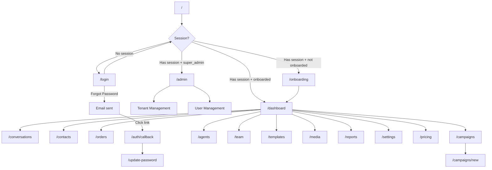

# App Flow — Navigation & User Journey Map
## Ittisalo — AI-Powered Omnichannel WhatsApp CRM

**Version:** 1.0  
**Date:** July 12, 2026  
**Reference:** [PRD.md](./PRD.md) · [TRD.md](./TRD.md)

---

## 1. High-Level Navigation Map



---

## 2. Route Map — Every Page in the App

| Route | Auth Required | Layout | Purpose |
|-------|---------------|--------|---------|
| `/` | — | Redirect | Gateway: redirects to `/login`, `/onboarding`, `/dashboard`, or `/admin` |
| `/login` | ❌ | Full-screen | Email/password login, forgot password |
| `/onboarding` | ✅ | Full-screen | 2-step niche selection + business details |
| `/auth/callback` | — | — | PKCE code exchange for password reset |
| `/update-password` | ✅ | Full-screen | New password entry after reset |
| `/dashboard` | ✅ | AppShell | Main dashboard with niche-specific metrics |
| `/conversations` | ✅ | AppShell | Unified chat inbox (WhatsApp, IG, Messenger) |
| `/contacts` | ✅ | AppShell | Customer contact management |
| `/orders` | ✅ | AppShell | Orders/Appointments/Leads Kanban board |
| `/campaigns` | ✅ | AppShell | Campaign list and analytics |
| `/campaigns/new` | ✅ | AppShell | Create new broadcast campaign |
| `/agents` | ✅ | AppShell | AI agent configuration and training |
| `/team` | ✅ | AppShell | Team member management |
| `/templates` | ✅ | AppShell | WhatsApp message template management |
| `/media` | ✅ | AppShell | Media library (images, documents) |
| `/reports` | ✅ | AppShell | Analytics and reporting |
| `/settings` | ✅ | AppShell | Business profile, channels, integrations |
| `/pricing` | ✅ | AppShell | Plan selection and subscription |
| `/privacy` | ❌ | Full-screen | Privacy policy (static) |
| `/terms` | ❌ | Full-screen | Terms of service (static) |
| `/admin` | ✅ (super_admin) | AppShell | Super admin panel |

---

## 3. Page-by-Page User Journeys

### 3.1 First-Time User Journey (Onboarding)

```
1. User receives invite email or navigates to app
   ↓
2. /login → Enters email + password → Sign In
   ↓
3. AppShell detects: no niche set, onboarding_completed=false
   ↓
4. Redirect → /onboarding
   ↓
5. STEP 1: Select business niche (6 options in grid)
   - Restaurant, eCommerce, Dental, Real Estate, Salon, Medical Clinic
   - Click one → red highlight with checkmark
   - Click "Continue →"
   ↓
6. STEP 2: Enter business details
   - Business Name (text input)
   - WhatsApp Business Number (phone input)
   - See "Change" link to go back to Step 1
   - Click "Launch My Dashboard 🚀"
   ↓
7. Backend actions:
   - Updates tenants table: niche, business_name, business_phone, plan='trial'
   - Creates/updates AI agent in agents table with niche-specific config
   - Sets onboarding_completed=true
   ↓
8. Redirect → /dashboard
```

### 3.2 Returning User Journey (Login → Dashboard)

```
1. /login → Enter credentials → Sign In
   ↓
2. AppShell checks session + onboarding status
   ↓
3. If onboarded → Redirect to /dashboard
   ↓
4. Dashboard loads:
   a. If Meta NOT connected OR plan NOT active:
      → Show "Action Center" dashboard
      → 3 action cards: Connect WhatsApp, Marketing API, Subscribe
      → Social media connection block
      → QR code block
      → Connected accounts status
   
   b. If Meta connected AND plan active:
      → Show full niche-specific dashboard
      → 4 stat cards (niche-dependent)
      → Charts: chat volume, channel distribution
      → Live order queue / appointment schedule / lead pipeline
      → AI agent performance metrics
```

### 3.3 Conversation Flow

```
1. /conversations → Conversation list (left panel)
   ↓
2. Each conversation shows:
   - Customer name, avatar initials
   - Platform badge (WhatsApp/Instagram/Messenger)
   - Last message preview
   - Unread count badge
   - Status: open (green), pending (amber), resolved (gray)
   ↓
3. Click conversation → Chat panel (right side)
   ↓
4. Chat panel shows:
   - Message history (customer messages left, bot/agent messages right)
   - Message input field at bottom
   - Quick replies dropdown
   - AI toggle (on/off)
   - Assign to agent button
   ↓
5. Agent types message → sends via Meta API → saved to messages table
   ↓
6. Real-time: new messages appear instantly (Supabase Realtime)
   ↓
7. Human handoff: Set status to "pending" → AI stops responding
   → Team member handles manually
   → Set status back to "open" → AI resumes
```

### 3.4 Order Management Flow

```
1. /orders → Kanban board view
   ↓
2. Board columns depend on niche:
   
   eCommerce: Pending Address → Confirmed → Dispatched → Delivered
   Restaurant: Pending → Confirmed → Preparing → Delivered
   Dental/Salon: Pending → Confirmed → Completed → Cancelled
   Real Estate: New Inquiry → Qualified → Properties Sent → Visit Scheduled → Closed
   ↓
3. Each card shows:
   - Customer name and phone
   - Order items / appointment details / lead requirements
   - Status badge
   - Action buttons (Confirm, Dispatch, Deliver, Cancel)
   ↓
4. Click action → updates status in DB → card moves to next column
   ↓
5. Real-time: new orders from AI agent appear automatically
```

### 3.5 Campaign Creation Flow

```
1. /campaigns → Campaign list with stats
   ↓
2. Click "New Campaign" → /campaigns/new
   ↓
3. Step-by-step form:
   a. Campaign Name
   b. Select Template (from approved WhatsApp templates)
   c. Select Contact Segment (All Contacts, Custom filter)
   d. Schedule or Send Now
   ↓
4. Click "Send Campaign"
   ↓
5. Backend:
   - Creates campaign record
   - Creates campaign_messages for each recipient
   - Calls Meta API to send each message
   - Stores meta_message_id for delivery tracking
   ↓
6. Real-time status updates:
   - Meta sends delivery webhooks → webhook service updates campaign_messages
   - Dashboard shows: Sent, Delivered, Read, Failed counts
```

### 3.6 Settings Flow

```
1. /settings → Tabbed interface
   ↓
2. Tabs:
   a. Business Profile
      - Business name, phone, website, location
      - Logo upload
      - Niche-specific settings
   
   b. Channels & APIs
      - WhatsApp Business API status
      - Phone Number ID, Access Token
      - Instagram Business connection
      - Facebook Page connection
   
   c. eCommerce Platform (eCommerce niche only)
      - WooCommerce site URL
      - Consumer key/secret
      - Connection test
   
   d. Plan & Billing
      - Current plan display
      - Usage metrics
      - Upgrade button → /pricing
```

### 3.7 Super Admin Flow

```
1. Login as super_admin → Redirect to /admin
   ↓
2. Admin Panel:
   a. Tenant List
      - All tenants with plan, status, niche, connection status
      - Search and filter
   
   b. Click tenant → Tenant Detail
      - View/edit plan (starter, growth, enterprise)
      - Suspend / unsuspend
      - View usage metrics
      - Admin notes
   
   c. User Management
      - All users across tenants
      - Role management
```

---

## 4. Navigation Structure

### 4.1 Desktop Sidebar (64px icon rail)

```
┌──────┐
│  A   │  ← Logo (links to /dashboard)
├──────┤
│  📊  │  Overview        → /dashboard
│  💬  │  Chats           → /conversations
│  👥  │  Contacts        → /contacts
│  🛍️  │  Orders          → /orders
│  📢  │  Campaigns       → /campaigns
│  🤖  │  AI Agents       → /agents
│  👥  │  Team            → /team
│  📄  │  Templates       → /templates
│  📁  │  Media           → /media
│  📈  │  Reports         → /reports
│  ⚙️  │  Settings        → /settings
│  👑  │  Super Admin     → /admin (if role=super_admin)
├──────┤
│  🔴  │  Avatar (niche initials)
│  🚪  │  Logout
└──────┘
```

### 4.2 Mobile Navigation

- **Bottom tab bar**: Shows first 5 items (Overview, Chats, Contacts, Orders, Campaigns) + "More" button
- **"More" button** → Opens bottom sheet with full 2-column grid of all nav items
- **Header bar**: Shows niche badge, "Ittisalo Studio" title, profile avatar dropdown

### 4.3 Top Bar (Sticky Header)

```
┌─────────────────────────────────────────────────────────┐
│  [Niche Badge]  Ittisalo Studio (Admin)  ...  [Avatar ▼] │
│                                                          │
│  Dropdown: My Profile, AI Copilot Config,                │
│            Connected Channels, System Settings, Log out  │
└─────────────────────────────────────────────────────────┘
```

### 4.4 Top Banner (Sticky, above header)

A persistent top banner can display:
- Subscription warnings ("No Subscription Found")
- Meta connection prompt ("Connect your WhatsApp Business")

---

## 5. Protected Route Logic

The `AppShell` component manages all routing guards:

```typescript
// Priority order of checks:
1. No session → redirect to /login
2. Is super_admin + on "/" → redirect to /admin
3. Is super_admin + on /login → redirect to /admin
4. Not onboarded + not on /onboarding → redirect to /onboarding
5. Onboarded + on /onboarding → redirect to /dashboard
6. On "/" + onboarded → redirect to /dashboard
7. On /update-password → allow (no redirect)
8. On /login + has session → redirect to /dashboard
```

---

## 6. Full-Screen vs AppShell Pages

| Full-Screen (no sidebar) | AppShell (sidebar + header) |
|-|-|
| `/login` | `/dashboard` |
| `/onboarding` | `/conversations` |
| `/update-password` | `/contacts`, `/orders`, `/campaigns` |
| | `/agents`, `/team`, `/templates` |
| | `/media`, `/reports`, `/settings` |
| | `/pricing`, `/admin` |

---

## 7. Data Flow Per Page

| Page | Data Source | Realtime? | Key Queries |
|------|------------|-----------|-------------|
| Dashboard | `conversations`, `messages`, `orders`, `appointments`, `leads` | ✅ | Aggregate counts, 7-day volume |
| Conversations | `conversations`, `messages` | ✅ | List by tenant, message history per conversation |
| Contacts | `conversations` (derived) | ❌ | Unique customers by phone |
| Orders | `orders`, `appointments`, `leads` | ✅ | Filter by status, niche-specific |
| Campaigns | `campaigns`, `campaign_messages` | ✅ | List campaigns, delivery stats |
| Agents | `agents`, `knowledge_base` | ❌ | Agent config, KB entries |
| Team | `users` | ❌ | Team members by tenant |
| Templates | `templates` | ❌ | List templates, status |
| Settings | `tenants`, `integration_credentials` | ❌ | Tenant config, integrations |
| Admin | `tenants`, `users`, `plans` | ❌ | All tenants, all users |
