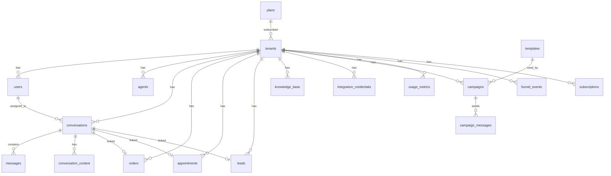

# Backend Schema — Data Model & Auth Architecture
## Ittisalo — AI-Powered Omnichannel WhatsApp CRM

**Version:** 1.0 | **Date:** July 12, 2026

---

## 1. Entity Relationship Diagram



---

## 2. Complete Table Reference

### 2.1 `tenants` — Multi-Tenant Root

The central table. Every business is a tenant. All other data is scoped to a tenant.

| Column | Type | Default | Description |
|--------|------|---------|-------------|
| `id` | UUID (PK) | `gen_random_uuid()` | Tenant ID |
| `name` | TEXT | NOT NULL | Auto-generated workspace name |
| `business_name` | TEXT | — | User-entered business name |
| `business_phone` | TEXT | — | WhatsApp business number |
| `niche` | TEXT | `'general'` | Industry vertical (`restaurant`, `ecommerce`, `dental`, `realestate`, `salon`, `clinic`) |
| `website` | TEXT | — | Business website URL |
| `location` | TEXT | — | Physical address |
| `logo_url` | TEXT | — | Logo image URL |
| `owner_name` | TEXT | — | Business owner name |
| `catalog_link` | TEXT | — | Product catalog URL |
| `menu_link` | TEXT | — | Restaurant menu URL |
| `delivery_days` | INTEGER | `3` | Default delivery days |
| `min_order` | INTEGER | `0` | Minimum order amount |
| `cod_enabled` | BOOLEAN | `true` | Cash on delivery enabled |
| `niche_settings` | JSONB | `'{}'` | Niche-specific config |
| `plan` | TEXT | `'trial'` | Plan tier: `starter`, `growth`, `enterprise`, `trial` |
| `plan_status` | TEXT | `'trial'` | Status: `active`, `suspended`, `trial`, `cancelled` |
| `trial_ends_at` | TIMESTAMPTZ | `now() + 14 days` | Trial expiration |
| `plan_changed_at` | TIMESTAMPTZ | — | Last plan change timestamp |
| `plan_changed_by` | TEXT | — | Who changed the plan |
| `onboarding_completed` | BOOLEAN | `false` | Onboarding wizard completed |
| `meta_connected` | BOOLEAN | `false` | Meta Business API connected |
| `wa_phone_number_id` | TEXT | — | WhatsApp phone number ID |
| `wa_access_token` | TEXT | — | WhatsApp access token |
| `wa_token_enc` | TEXT | — | Encrypted WA token |
| `wa_account_id` | TEXT | — | WhatsApp Business Account ID |
| `ig_page_id` | TEXT | — | Instagram page ID |
| `fb_page_id` | TEXT | — | Facebook page ID |
| `admin_notes` | TEXT | — | Super admin notes |
| `suspended_reason` | TEXT | — | Reason for suspension |
| `metadata` | JSONB | `'{}'` | Flexible extra config |
| `created_at` | TIMESTAMPTZ | `now()` | Creation timestamp |

**Constraints:** `plan_check` (plan IN starter/growth/enterprise/trial), `plan_status_check`

### 2.2 `users` — User Profiles (extends Supabase Auth)

| Column | Type | Default | Description |
|--------|------|---------|-------------|
| `id` | UUID (PK, FK → auth.users) | — | Supabase auth user ID |
| `tenant_id` | UUID (FK → tenants) | — | Owning tenant |
| `full_name` | TEXT | — | Display name |
| `role` | TEXT | `'agent'` | `admin`, `agent`, `super_admin` |
| `created_at` | TIMESTAMPTZ | `now()` | — |

**Trigger:** `handle_new_user()` — auto-creates tenant + user profile on Supabase Auth signup.

### 2.3 `conversations` — Chat Threads

| Column | Type | Default | Description |
|--------|------|---------|-------------|
| `id` | UUID (PK) | `gen_random_uuid()` | — |
| `tenant_id` | UUID (FK → tenants) | — | — |
| `platform` | TEXT | — | `whatsapp`, `instagram`, `messenger` |
| `external_conversation_id` | TEXT | — | Customer phone/PSID/IGSID |
| `customer_name` | TEXT | — | Resolved customer name |
| `status` | TEXT | `'open'` | `open`, `resolved`, `pending` |
| `unread_count` | INTEGER | `0` | Unread message count |
| `assigned_to` | UUID (FK → users) | — | Human handoff assignment |
| `assigned_at` | TIMESTAMPTZ | — | Assignment timestamp |
| `last_message_preview` | TEXT | — | Preview text for list view |
| `created_at` | TIMESTAMPTZ | `now()` | — |
| `updated_at` | TIMESTAMPTZ | `now()` | — |

**Unique:** `(tenant_id, external_conversation_id)` — prevents duplicate conversations.

### 2.4 `messages` — Individual Messages

| Column | Type | Default | Description |
|--------|------|---------|-------------|
| `id` | UUID (PK) | `gen_random_uuid()` | — |
| `conversation_id` | UUID (FK → conversations) | — | Parent conversation |
| `sender_type` | TEXT | — | `customer`, `agent`, `bot` |
| `content` | TEXT | — | Message body |
| `external_message_id` | TEXT (UNIQUE) | — | Meta message ID (dedup) |
| `is_read` | BOOLEAN | `false` | Read status |
| `created_at` | TIMESTAMPTZ | `now()` | — |

### 2.5 `orders` — eCommerce & Restaurant Orders

| Column | Type | Default | Description |
|--------|------|---------|-------------|
| `id` | UUID (PK) | `gen_random_uuid()` | — |
| `tenant_id` | UUID (FK) | — | — |
| `conversation_id` | UUID (FK, UNIQUE) | — | One order per conversation |
| `customer_phone` | TEXT | NOT NULL | — |
| `customer_name` | TEXT | — | — |
| `items` | JSONB | `'[]'` | `[{name, qty, price, size, variant}]` |
| `order_amount` | DECIMAL(12,2) | `0` | Total amount |
| `currency` | TEXT | `'PKR'` | — |
| `order_type` | TEXT | `'delivery'` | `delivery`, `takeaway`, `dine_in`, `bulk_event` |
| `delivery_address` | TEXT | — | — |
| `notes` | TEXT | — | — |
| `niche` | TEXT | `'ecommerce'` | `ecommerce`, `restaurant` |
| `status` | TEXT | `'pending_address'` | Pipeline status |
| `handled_by` | TEXT | `'bot'` | `bot`, `human` |
| `source` | TEXT | `'whatsapp'` | Channel source |
| `issue_type` | TEXT | — | `wrong_order`, `late`, `missing_item` |
| `confirmed_at` | TIMESTAMPTZ | — | — |
| `dispatched_at` | TIMESTAMPTZ | — | — |
| `delivered_at` | TIMESTAMPTZ | — | — |
| `whatsapp_notified_status` | TEXT | — | Prevents duplicate WA sends |
| `created_at` | TIMESTAMPTZ | `now()` | — |

### 2.6 `appointments` — Dental, Salon, Clinic

| Column | Type | Default | Description |
|--------|------|---------|-------------|
| `id` | UUID (PK) | `gen_random_uuid()` | — |
| `tenant_id` | UUID (FK) | — | — |
| `conversation_id` | UUID (FK, UNIQUE) | — | — |
| `patient_name` | TEXT | — | — |
| `patient_phone` | TEXT | NOT NULL | — |
| `doctor_name` | TEXT | — | Doctor/stylist name |
| `service_type` | TEXT | — | Treatment/service |
| `niche` | TEXT | `'dental'` | `dental`, `salon`, `clinic` |
| `appointment_date` | DATE | — | — |
| `appointment_time` | TIME | — | — |
| `status` | TEXT | `'pending'` | `pending`, `confirmed`, `completed`, `cancelled`, `no_show` |
| `is_new_patient` | BOOLEAN | `false` | — |
| `reminder_sent` | BOOLEAN | `false` | — |
| `estimated_revenue` | DECIMAL(10,2) | — | — |
| `google_event_id` | TEXT | — | Google Calendar sync |
| `notes` | TEXT | — | — |
| `created_at` | TIMESTAMPTZ | `now()` | — |

### 2.7 `leads` — Real Estate Pipeline

| Column | Type | Default | Description |
|--------|------|---------|-------------|
| `id` | UUID (PK) | `gen_random_uuid()` | — |
| `tenant_id` | UUID (FK) | — | — |
| `conversation_id` | UUID (FK, UNIQUE) | — | — |
| `customer_name` | TEXT | — | — |
| `customer_phone` | TEXT | NOT NULL | — |
| `intent` | TEXT | — | `buy`, `rent`, `sell` |
| `property_type` | TEXT | — | `apartment`, `house`, `plot`, `commercial` |
| `area_preference` | TEXT | — | — |
| `bedrooms` | INTEGER | — | — |
| `budget_min` | DECIMAL(15,2) | — | — |
| `budget_max` | DECIMAL(15,2) | — | — |
| `stage` | TEXT | `'new_inquiry'` | Pipeline: `new_inquiry → qualified → properties_sent → visit_scheduled → closed_won/lost` |
| `temperature` | TEXT | `'warm'` | `hot`, `warm`, `cold` |
| `properties_sent` | JSONB | `'[]'` | — |
| `last_activity_at` | TIMESTAMPTZ | `now()` | — |
| `created_at` | TIMESTAMPTZ | `now()` | — |

### 2.8 `knowledge_base` — AI Training Data

| Column | Type | Default | Description |
|--------|------|---------|-------------|
| `id` | UUID (PK) | `gen_random_uuid()` | — |
| `tenant_id` | UUID (FK) | — | — |
| `kb_type` | TEXT | `'text'` | `url`, `pdf`, `text`, `faq`, `product_catalog`, `menu`, `location` |
| `title` | TEXT | NOT NULL | Entry title |
| `content` | TEXT | — | Extracted/entered text |
| `file_url` | TEXT | — | Supabase Storage URL |
| `source_url` | TEXT | — | Scraped URL source |
| `metadata` | JSONB | `'{}'` | Extra data |
| `is_active` | BOOLEAN | `true` | Active toggle |
| `created_at` | TIMESTAMPTZ | `now()` | — |
| `updated_at` | TIMESTAMPTZ | `now()` | — |

### 2.9 `campaigns` & `campaign_messages`

**campaigns:**

| Column | Type | Default | Description |
|--------|------|---------|-------------|
| `id` | UUID (PK) | `gen_random_uuid()` | — |
| `tenant_id` | UUID (FK) | NOT NULL | — |
| `name` | TEXT | NOT NULL | Campaign name |
| `template_id` | UUID (FK → templates) | — | — |
| `template_name` | TEXT | NOT NULL | — |
| `segment_name` | TEXT | `'All Contacts'` | — |
| `status` | TEXT | `'Draft'` | `Draft`, `In Progress`, `Completed`, `Scheduled`, `Failed` |
| `scheduled_at` | TIMESTAMPTZ | — | — |
| `total_recipients` | INTEGER | `0` | — |
| `sent_count` | INTEGER | `0` | — |
| `delivered_count` | INTEGER | `0` | — |
| `read_count` | INTEGER | `0` | — |
| `failed_count` | INTEGER | `0` | — |

**campaign_messages:**

| Column | Type | Default | Description |
|--------|------|---------|-------------|
| `id` | UUID (PK) | `gen_random_uuid()` | — |
| `campaign_id` | UUID (FK → campaigns) | NOT NULL | — |
| `tenant_id` | UUID (FK) | NOT NULL | — |
| `recipient_phone` | TEXT | NOT NULL | — |
| `recipient_name` | TEXT | — | — |
| `meta_message_id` | TEXT (UNIQUE) | — | For delivery tracking |
| `status` | TEXT | `'queued'` | `queued`, `sent`, `delivered`, `read`, `failed` |
| `error_message` | TEXT | — | — |

### 2.10 Other Tables

| Table | Purpose |
|-------|---------|
| `agents` | AI bot config (name, prompt, is_active) per tenant |
| `subscriptions` | Legacy subscription tracking |
| `integrations` | Platform routing (meta → tenant_id mapping) |
| `integration_credentials` | Shopify/WooCommerce/Google Calendar credentials |
| `conversation_context` | AI intent + funnel stage tracking per conversation |
| `funnel_events` | Conversion funnel tracking (stage transitions) |
| `plans` | Plan tier definitions (limits, pricing, features) |
| `usage_metrics` | Monthly usage counters per tenant |
| `audit_logs` | Action audit trail |
| `templates` | WhatsApp message templates |
| `price_list` | Service/treatment pricing |
| `listings` | Real estate property listings |
| `restaurant_orders` | Legacy restaurant-specific orders |

---

## 3. Row-Level Security (RLS) Architecture

### 3.1 Standard Tenant Isolation Pattern

```sql
CREATE POLICY "tenant_[table]" ON public.[table] FOR ALL
  USING (tenant_id IN (
    SELECT tenant_id FROM public.users WHERE id = auth.uid()
  ));
```

### 3.2 Super Admin Override

```sql
CREATE POLICY "Super admin can view all [table]" ON public.[table] FOR SELECT
  USING (EXISTS (
    SELECT 1 FROM public.users WHERE id = auth.uid() AND role = 'super_admin'
  ));
```

### 3.3 RLS Coverage

Every table with `tenant_id` has RLS enabled with tenant isolation policies. The `plans` table uses authenticated-user SELECT policy for all users and super_admin-only ALL policy for modifications.

---

## 4. Auth Architecture

```
                    ┌──────────────────────────┐
                    │    Supabase Auth          │
                    │  - Email/password signup  │
                    │  - JWT session tokens     │
                    │  - Password reset (PKCE)  │
                    └─────────┬────────────────┘
                              │ ON INSERT trigger
                              ▼
                    ┌──────────────────────────┐
                    │  handle_new_user()        │
                    │  1. Create new tenant     │
                    │  2. Check super_admin     │
                    │  3. Insert user profile   │
                    └──────────────────────────┘
```

### Supabase Clients

| Client | Key | RLS | Usage |
|--------|-----|-----|-------|
| Browser (`client.ts`) | `ANON_KEY` | ✅ Enforced | Client-side queries |
| Server (`server.ts`) | `ANON_KEY` + cookies | ✅ Enforced | SSR queries |
| Service (`service.ts`) | `SERVICE_ROLE_KEY` | ❌ Bypassed | Webhook service, API routes |

---

## 5. Indexes

| Index | Table | Columns | Purpose |
|-------|-------|---------|---------|
| `idx_orders_tenant_status` | orders | `(tenant_id, status)` | Dashboard filters |
| `idx_orders_customer_phone` | orders | `(customer_phone)` | Lookup by phone |
| `idx_appointments_tenant_date` | appointments | `(tenant_id, appointment_date)` | Schedule queries |
| `idx_appointments_reminder` | appointments | `(reminder_sent, status, appointment_date)` | Reminder job |
| `idx_leads_tenant_stage` | leads | `(tenant_id, stage)` | Pipeline views |
| `idx_leads_temperature` | leads | `(temperature, last_activity_at)` | Hot lead sorting |
| `idx_funnel_tenant` | funnel_events | `(tenant_id, stage, created_at)` | Analytics |

---

## 6. Realtime-Enabled Tables

`conversations`, `messages`, `orders`, `appointments`, `leads`, `funnel_events`, `knowledge_base`, `conversation_context`, `campaigns`, `campaign_messages`

---

## 7. Migration History (21 migrations)

| Migration | Purpose |
|-----------|---------|
| `20260505000000` | Initial schema (tenants, users, conversations, messages, agents, subscriptions) |
| `20260505000001` | Auth trigger (handle_new_user) |
| `20260505000002` | Integrations table |
| `20260506000001` | Dev RLS policies |
| `20260513_*` | Audit logs, triggers, role updates |
| `20260514_*` | Dedup fixes, integration remapping |
| `20260520000000` | Vertical niche workspace |
| `20260530000000` | Knowledge base, orders, funnel events |
| `20260530000001` | Niche-specific tables (restaurant_orders, appointments, leads, listings) |
| `20260605000000` | Unified orders |
| `20260607000000` | v2 Orders window (full schema with appointments, leads) |
| `20260607100000` | Campaigns and campaign_messages |
| `20260622_*` | Plans, limits, usage metrics, tenant extensions |
| `20260623_*` | Super admin privileges |
| `20260625_*` | Conversation columns, RLS fixes |
| `20260626_*` | Tenant settings columns |
